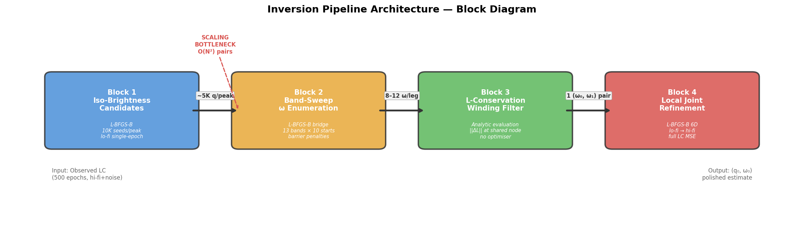
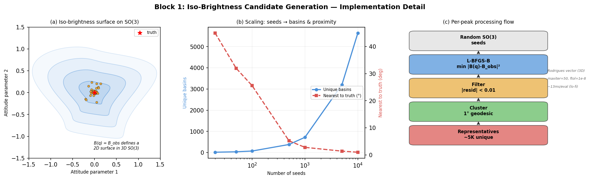
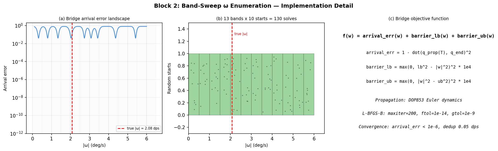
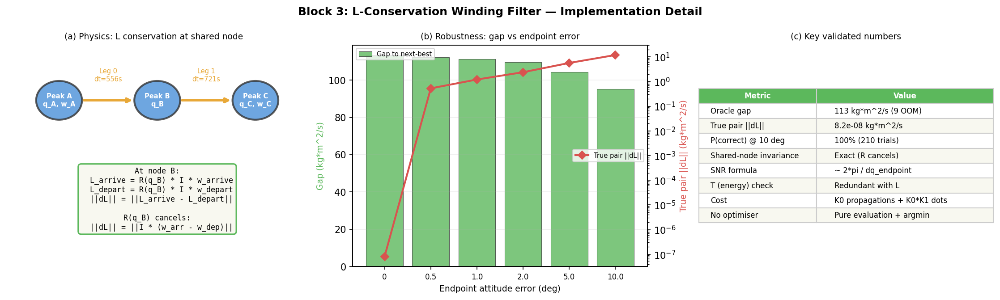
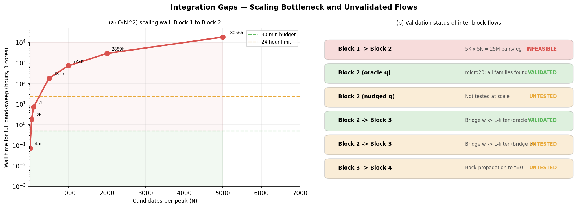

# Inversion Pipeline Specification — Block-Level Architecture

**Date:** 2026-03-11
**Branch:** `inversion_q_w`
**Status:** Pre-integration — all blocks validated independently, not yet wired together
**Prerequisite reading:** `docs/reports/series07_findings_report.md`

---

## Purpose

This document specifies the four-block inversion pipeline in full implementation detail. Each block is defined by its inputs, outputs, optimiser, objective function, parameterisation, cost, and known limitations. The goal is to provide a complete reference for integration experiments (Series 08) and to clearly identify the roadblocks that must be resolved before end-to-end operation.

### Test Case (all experiments)

| Parameter | Value |
|-----------|-------|
| Satellite | Intelsat 901 |
| True q₀ | axis=[0.6, 0.3, 0.8]/norm, angle=45° |
| True ω₀ | [0.5, -0.3, 2.0] deg/s ("fast tumbler") |
| \|ω₀\| | 2.083 deg/s |
| Observations | 500 epochs, dt ≈ 7.2s, window = 3600s |
| Fidelity | Lo-fi = no shadows; Hi-fi = ray-traced shadows |
| Propagation | Torque-free Euler dynamics (DOP853 ODE solver) |
| Inertia | Intelsat 901 mesh-derived tensor (triaxial, asymmetry = 0.556) |

### Peaks Used

| Peak | Epoch index | Time (s) |
|------|-------------|----------|
| A | 183 | ~1321s |
| B | 260 | ~1877s |
| C | 360 | ~2598s |

Legs: **Leg 0** A→B (dt = 555.5s), **Leg 1** B→C (dt = 721.4s).

---

## Pipeline Overview



| Block | Input | Method | Output | Cost | Validated by |
|-------|-------|--------|--------|------|-------------|
| 1. Iso-brightness candidates | Observed LC at peak epochs | L-BFGS-B, 10K seeds/peak, lo-fi | ~5K attitudes per peak | ~5 min/peak (8 cores) | Series 02/05 (micro09/10) |
| 2. Band-sweep ω enumeration | Candidate pair (q_A, q_B) per leg | L-BFGS-B bridge, 13 bands × 10 starts | 8–12 ω candidates per pair·leg | ~5s/pair (8 cores) | Series 07c (micro19/20) |
| 3. L-conservation filter | All (ω_leg0, ω_leg1) pairs at shared node | Analytic: \|\|ΔL\|\| evaluation | Top-1 (ω₀, ω₁) pair | Negligible | Series 07b (micro23/24/25) |
| 4. Local joint refinement | Best (q₀, ω₀) estimate | L-BFGS-B on full 6D LC residual | Final polished (q₀, ω₀) | ~5 min lo-fi, ~4h hi-fi | Series 00/04 |

---

## Block 1: Iso-Brightness Candidate Generation



### Goal

At each brightness peak epoch, find all attitude quaternions that produce the observed brightness value. The iso-brightness constraint `B(q) = B_obs` defines a 2D surface in SO(3); multi-start optimisation samples this surface densely.

### Inputs

| Input | Type | Source |
|-------|------|--------|
| Observed magnitude at peak | scalar (float) | `CTX.observed_lc[peak_idx]` |
| Peak epoch index | int | From peak detection on observed LC |
| Satellite model | `Satellite` object | STL loader |
| Sun/observer/sat positions at epoch | (3,) arrays, J2000 km | SPICE geometry |
| Observer distance at epoch | scalar km | SPICE geometry |
| Articulation matrices | dict of (N,4,4) arrays | Fixed angles (SP=0°, AD=15°) |

### Output

| Output | Type | Shape |
|--------|------|-------|
| Candidate quaternions | ndarray, wxyz convention | (N_cands, 4) |
| Brightness at each candidate | ndarray, magnitudes | (N_cands,) |
| Brightness gradient vectors | ndarray | (N_cands, 3) |
| Angular distance to truth | ndarray, degrees | (N_cands,) |

### Parameterisation

- **Rodrigues vector** (3D, unconstrained): `rotvec ∈ R³`
- Conversion: `Rotation.from_rotvec(rotvec).as_quat()` → (x,y,z,w) → reorder to (w,x,y,z)
- No singularities for rotations < 2π

### Objective Function

```
f(rotvec) = (B_lofi(q(rotvec), epoch_idx) - B_observed)²
```

**Forward model per evaluation:**
1. `Rotation.from_rotvec(rotvec)` → rotation matrix R
2. `k1 = R @ (sun_pos - sat_pos)`, normalise → sun direction in body frame
3. `k2 = R @ (obs_pos - sat_pos)`, normalise → observer direction in body frame
4. `create_no_shadow_lit_status()` → all facets lit (lo-fi)
5. `generate_lightcurves(lit, k1, k2, distance, ...)` → magnitude

**Cost per evaluation:** ~13ms (single-epoch lo-fi, no shadows)

### Optimiser

| Parameter | Value |
|-----------|-------|
| Algorithm | L-BFGS-B (`scipy.optimize.minimize`) |
| Max iterations | 50 |
| ftol | 1e-8 |
| Bounds | None (Rodrigues vector unconstrained) |
| Gradient | Finite differences (scipy default) |

### Seeding

- 10,000 random SO(3) seeds: `Rotation.random(10000)`
- One L-BFGS-B run per seed
- Seeds are independent → embarrassingly parallel

### Post-Processing

1. **Filter converged:** `|residual| < 0.01` magnitudes
2. **Cluster:** Complete-linkage hierarchical clustering on quaternion geodesic distance matrix, threshold = 1°
3. **Representatives:** Best (lowest residual) per cluster

### Parallelisation

- `multiprocessing.get_context('fork').Pool(8)`
- One seed per task, chunksize=16
- Module-level global `CTX` inherited by forked workers

### Validated Results (micro10, peak A only)

| Metric | Value |
|--------|-------|
| Seeds | 10,000 |
| Converged | ~9,000 |
| Unique basins (1° clustering) | 5,643 |
| Nearest to truth | ~1° |
| Runtime | ~5 min (8 cores) |

### Implementation Reference

- Script: `notebooks/inversion/05_peak_graph_pipeline/micro10_scaled_isobrightness.py`
- Results: `data/results/inversion_diagnostics/micro10_optimized_candidates.npz`
- Pre-selected 50/peak: `data/results/inversion_diagnostics/micro13_stage1.npz`

---

## Block 2: Band-Sweep ω Enumeration



### Goal

For a given pair of endpoint quaternions (q_start at peak A, q_end at peak B), find ALL angular velocity vectors ω that rotate q_start to q_end under torque-free Euler dynamics in time dt. These are the "winding solutions" — each differs by roughly one full revolution.

### Inputs

| Input | Type | Source |
|-------|------|--------|
| q_start | (4,) wxyz quaternion | Block 1 candidate at start peak |
| q_end | (4,) wxyz quaternion | Block 1 candidate at end peak |
| dt | scalar (seconds) | Time between peaks |
| I | (3,3) inertia tensor (kg·m²) | Mesh-derived |

### Output

| Output | Type | Description |
|--------|------|-------------|
| ω candidates | list of (3,) arrays, rad/s | Body-frame ω at q_start, 8–12 per pair |
| \|ω\| per candidate | float, deg/s | Magnitude of each |
| Arrival error per candidate | float | Bridge quality metric |

### Magnitude Band Structure

```
[0.0, 0.5), [0.5, 1.0), [1.0, 1.5), ..., [6.0, 6.5)  →  13 bands
```

- Band width: 0.5 deg/s
- Each band searched independently with 10 random starts
- Total: 13 × 10 = **130 bridge solves per (q_start, q_end) pair per leg**

### Objective Function

```
f(ω) = arrival_error(ω) + barrier_lb(ω) + barrier_ub(ω)
```

**Arrival error:**
```python
qp, _ = propagate_attitude(q_start, ω, [0.0, dt], "tumbling", I)
d = clamp(dot(qp[-1], q_end), -1, 1)
arrival_error = 1 - d²
```

**Barrier penalties (confine |ω| to band):**
```python
barrier_lb = max(0, lb² - |ω|²)² × 1e4
barrier_ub = max(0, |ω|² - ub²)² × 1e4
```

Where lb, ub are band edges in rad/s. Penalty coefficient = 1e4 (empirical).

### Attitude Propagation

The inner loop of each bridge solve calls `propagate_attitude()`:

| Parameter | Value |
|-----------|-------|
| ODE system | Coupled quaternion + Euler equations |
| q_dot | `0.5 × q ⊗ ω_quat` (quaternion kinematic equation) |
| ω_dot | `I⁻¹ × (I·ω × ω)` (Euler's equations, torque-free) |
| Solver | DOP853 (8th-order Dormand-Prince) |
| rtol | 1e-12 |
| atol | 1e-12 |
| Cost | ~2ms for 2 time points, ~77ms for 500 epochs |

### Optimiser

| Parameter | Value |
|-----------|-------|
| Algorithm | L-BFGS-B (`scipy.optimize.minimize`) |
| Max iterations | 200 |
| ftol | 1e-14 |
| gtol | 1e-9 |
| Bounds | None (barriers handle magnitude confinement) |
| Gradient | Finite differences (scipy default) |

### Seeding (per band)

- Random direction: `randn(3)`, normalised to unit vector
- Random magnitude: uniform in `[lb, ub]` (rad/s)
- Initial guess: `ω₀ = magnitude × direction`

### Post-Processing

1. **Filter:** `arrival_err < 0.001` (or 1e-6 for tighter threshold)
2. **Deduplicate:** Within 0.05 deg/s of |ω| → keep best by arrival error
3. **Result:** Typically 8–12 unique ω candidates per leg

### Parallelisation

- `multiprocessing.Pool(8)` with `_init_worker(shared)` pattern
- Shared data (q_start, q_end, dt, I) stored as module-level global dict
- One band-start pair per task, chunksize=4
- Cost per solve: ~160ms → 130 solves ≈ 21s serial, ~5s on 8 cores

### Validated Results

| Experiment | Leg | Candidates found | True ω found? | Runtime |
|------------|-----|-----------------|---------------|---------|
| micro19 (dense sweep) | 0 | 10 valleys | Yes (2.03 dps) | 434s |
| micro19 (dense sweep) | 1 | 6 valleys | Yes (2.40 dps center) | (same run) |
| micro20 (band sweep) | 1 | All 12 bands non-empty | Yes | 957s |

### Implementation Reference

- Script: `notebooks/inversion/07_winding_enumeration/micro20_multistart_staircase.py`
- Results: `data/results/inversion_diagnostics/micro20_multistart_staircase.json`

---

## Block 3: L-Conservation Winding Filter



### Goal

From the ω candidate sets on two legs sharing a peak node, select the pair whose angular momentum is most consistent. L-conservation is a hard physical constraint for torque-free motion — only the correct winding pair will satisfy it.

### Inputs

| Input | Type | Source |
|-------|------|--------|
| Leg 0 ω candidates | list of K₀ (3,) arrays, rad/s | Block 2 output for leg 0 |
| Leg 1 ω candidates | list of K₁ (3,) arrays, rad/s | Block 2 output for leg 1 |
| q_A | (4,) wxyz quaternion | Block 1 candidate at peak A |
| q_B | (4,) wxyz quaternion | Block 1 candidate at shared peak B |
| dt_0 | scalar (seconds) | Leg 0 duration |
| I | (3,3) inertia tensor (kg·m²) | Mesh-derived |

### Output

| Output | Type | Description |
|--------|------|-------------|
| Best pair (k*, j*) | (int, int) | Indices into leg 0, leg 1 candidate lists |
| \|\|ΔL\|\| gap | float, kg·m²/s | Separation between best and next-best |
| Selected ω vectors | two (3,) arrays, rad/s | The winning ω for each leg |

### Physics

Angular momentum is conserved in torque-free motion:

```
L = R(q) · (I · ω_body) = constant in inertial frame
```

At shared peak B, the arriving ω from leg 0 and the departing ω for leg 1 must produce the same L:

```
L_arrive = R(q_B) · I · ω_arrived_k
L_depart = R(q_B) · I · ω_j
||ΔL|| = ||L_arrive - L_depart||
```

**Critical simplification:** R(q_B) is orthogonal and appears in both L vectors, so it cancels:

```
||ΔL|| = ||I · (ω_arrived_k - ω_j)||
```

This means shared-node attitude error is **mathematically irrelevant** to the filter's correctness.

### Procedure

1. **Propagate leg 0 arrivals:** For each leg-0 candidate k, propagate q_A with ω_k for dt_0:
   ```python
   _, om_traj = propagate_attitude(q_A, ω_k, [0.0, dt_0], "tumbling", I)
   ω_arrived_k = om_traj[-1]  # body-frame ω at peak B
   ```

2. **Compute L vectors:**
   ```python
   def compute_L(q_wxyz, omega_body, I):
       w, x, y, z = q_wxyz
       R = [[1-2*(y²+z²), 2*(x*y-w*z), 2*(x*z+w*y)],
            [2*(x*y+w*z), 1-2*(x²+z²), 2*(y*z-w*x)],
            [2*(x*z-w*y), 2*(y*z+w*x), 1-2*(x²+y²)]]
       return R @ (I @ omega_body)
   ```

3. **Score matrix:** `L_err[k,j] = ||compute_L(q_B, ω_arrived_k, I) - compute_L(q_B, ω_j, I)||`

4. **Select:** `(k*, j*) = argmin(L_err)`, gap = `sorted(L_err.ravel())[1] - sorted(L_err.ravel())[0]`

### No Optimiser

This block is **pure evaluation + ranking**. No iterative solve. The score matrix is computed analytically from the ω candidates provided by Block 2.

### Cost

- K₀ propagations (one per leg-0 candidate, ~2ms each)
- K₀ × K₁ L-comparisons (matrix multiply + norm, negligible)
- For K₀ = K₁ = 12: total ~24ms + ~144 trivial operations

### Kinetic Energy (T) Check

```
|ΔT| = |0.5·ω_k^T·I·ω_k - 0.5·ω_j^T·I·ω_j|
```

Tested in micro23: ranks true pair #1 with 8 OOM gap, but provides **no additional discrimination beyond L**. Not used in the pipeline.

### Validated Results

| Experiment | Setup | True pair rank | Gap (kg·m²/s) | P(correct) |
|------------|-------|---------------|---------------|------------|
| micro23 (oracle) | Truth injected into both legs | 1/64 | 113.2 | 100% |
| micro24 (nudge 1°) | Endpoint q nudged 1° | 1/64 | 111.3 | 100% (30 trials) |
| micro24 (nudge 5°) | Endpoint q nudged 5° | 1/64 | 104.3 | 100% (30 trials) |
| micro24 (nudge 10°) | Endpoint q nudged 10° | 1/64 | 95.2 | 100% (30 trials) |
| micro25 (3 legs) | 4 peaks, 3 legs, 512 triples | 1/512 | — | 100% |

### Robustness Analysis

The winding spacing creates an L-gap of `~2π·||I||/dt` per winding number. Attitude-error-induced noise is `~||I||·δq/dt`. The signal-to-noise ratio:

```
SNR ≈ 2π / δq_endpoint (radians)
```

This is **independent of leg duration**. At δq = 10° (0.175 rad): SNR ≈ 36×.

### Implementation Reference

- Script: `notebooks/inversion/07_L_conservation/micro23_L_oracle_test.py`
- Results: `data/results/inversion_diagnostics/micro23_L_oracle_test.json`
- Nudge study: `micro24_L_nudge_sensitivity.py`

---

## Block 4: Local Joint Refinement

### Goal

Given a good initial (q₀, ω₀) estimate from Blocks 1–3, polish to convergence using the full lightcurve as objective. This is a standard local optimisation problem — the upstream blocks exist to get within the convergence basin.

### Inputs

| Input | Type | Source |
|-------|------|--------|
| Initial params | (6,) array: [axis_angle(3), omega(3)] | Back-propagated from Block 3 output |
| Observed lightcurve | (500,) magnitudes, hi-fi + noise | Ground truth simulation |
| Satellite model, geometry, inertia | various | `ExperimentContext` |

### Output

| Output | Type | Description |
|--------|------|-------------|
| Polished params | (6,) array | Final (q₀, ω₀) at t=0 |
| Residual | scalar | MSE at convergence |

### Parameterisation

- **6D:** `params = [ax_x, ax_y, ax_z, ωx, ωy, ωz]`
- Attitude: axis-angle → quaternion via `axis_angle_to_quaternion()`
  - `angle = ||axis_angle||`
  - `axis = axis_angle / angle`
  - `q = [cos(θ/2), sin(θ/2) · axis]`
- Omega: body-frame angular velocity in rad/s (direct)

### Objective Function (`ObjectiveFunction.evaluate`)

```
f(params) = MSE(predicted_LC, observed_LC)
```

**Steps per evaluation:**
1. `axis_angle_to_quaternion(params[:3])` → q₀
2. `propagate_attitude(q₀, params[3:6], times, "tumbling", I)` → quaternions (500, 4)
3. For each of 500 epochs: `R(q_i) @ sun_vec → k1`, `R(q_i) @ obs_vec → k2`
4. Lo-fi: `create_no_shadow_lit_status()`, or Hi-fi: `compute_shadows(satellite, k1, ...)`
5. `generate_lightcurves(lit, k1, k2, distances, ...)` → predicted magnitudes (500,)
6. `MSE = mean((predicted - observed)²)` over finite epochs

### Optimiser

| Parameter | Value |
|-----------|-------|
| Algorithm | L-BFGS-B (`scipy.optimize.minimize`) |
| Gradient | Finite differences |
| Strategy | Two-stage: lo-fi first (cheap), then hi-fi (expensive) |

### Cost Per Evaluation

| Fidelity | Cost | Components |
|----------|------|-----------|
| Lo-fi | ~221ms | 77ms propagation + 144ms lightcurve (no shadows) |
| Hi-fi | ~60s | 77ms propagation + ~60s shadow ray tracing |

One L-BFGS-B iteration ≈ 13 function evaluations:
- Lo-fi: ~3s/iteration
- Hi-fi: ~13 min/iteration

### Convergence Basin (from Series 04)

| Dimension | Basin width (hi-fi) | Basin width (lo-fi) |
|-----------|-------------------|-------------------|
| Attitude | ~5° | ~5° |
| ω direction | ~2° | ~2° |
| ω magnitude | ±10% | ±5% |
| Attitude error > 5° | ω recovery fails | ω recovery fails |

### Block 3 → Block 4 Interface

Block 3 produces the best (ω_leg0, ω_leg1) pair and the associated (q_A, q_B, q_C) from Block 1. To feed Block 4, we need (q₀, ω₀) at t=0:

1. Take q_A (attitude at peak A, time t_A) and ω_leg0 (body-frame ω at peak A)
2. Back-propagate to t=0: `propagate_attitude(q_A, ω_leg0, [0.0, -t_A], "tumbling", I)`
3. Extract q₀ = `q_traj[-1]`, ω₀ = `om_traj[-1]`
4. Convert q₀ to axis-angle for the 6D parameter vector

### Implementation Reference

- Objective function: `src/inversion/objective_function.py` (`ObjectiveFunction.evaluate`)
- Propagator: `src/dynamics/attitude_propagator.py` (`propagate_attitude`)
- Mixed-fidelity demo: `notebooks/inversion/08_mixed_fidelity_inversion.py`
- Basin characterisation: `notebooks/inversion/04_basin_characterisation/`

---

## Integration Gaps and Roadblocks



### The Scaling Bottleneck: Block 1 → Block 2

The critical integration problem is the **O(N²) pair explosion** between Block 1 and Block 2.

| Candidates/peak (N) | Pairs/leg (N²) | Band-sweep solves | Wall time (8 cores) |
|---------------------|----------------|-------------------|-------------------|
| 10 | 100 | 13,000 | 4 min |
| 50 | 2,500 | 325,000 | 2 hours |
| 100 | 10,000 | 1,300,000 | 7 hours |
| 500 | 250,000 | 32,500,000 | 7 days |
| 2,000 | 4,000,000 | 520,000,000 | 116 days |
| 5,000 | 25,000,000 | 3,250,000,000 | 2 years |

Block 1 produces ~5K candidates/peak. Full band-sweep at this scale is infeasible. A **screening step** between Block 1 and Block 2 is mandatory:

- **Proposed:** Single-bridge solve per pair (zero initial guess, no bands) as a cheap O(1) screen
- **Goal:** Reduce N² pairs to ~100 survivors before running full band-sweep
- **Status:** Unvalidated — this is the subject of proposed experiment micro27

### Unvalidated Inter-Block Flows

| Flow | Status | Risk | Proposed Experiment |
|------|--------|------|-------------------|
| Block 1 → Block 2 (scaling) | **INFEASIBLE** at N>100 | Showstopper without screening | micro27: single-bridge screening |
| Block 2 with nudged q (1–5°) | **UNTESTED** | Bridge may find wrong families with imperfect endpoints | micro28: integration with nudged attitudes |
| Block 2 → Block 3 (bridge-derived ω) | **UNTESTED** | Bridge ω has 13–25° direction error; L-filter tested only with oracle/hand-crafted ω | micro26: integration with oracle q |
| Block 3 → Block 4 (back-propagation) | **UNTESTED** | Back-propagation to t=0 is straightforward but not yet implemented | Depends on micro26/28 results |
| Block 1 at peaks B and C | **UNTESTED** | Only validated at peak A (epoch 183); different geometry may give different candidate density | Part of integration experiments |

### Intra-Block Issues

| Block | Issue | Severity |
|-------|-------|----------|
| Block 1 | Only validated at one peak | Medium — likely works but needs confirmation |
| Block 2 | Band range [0, 6.5] dps is hardcoded for this test case | Low — easy to adjust |
| Block 2 | 130 solves/pair may be reducible (some bands always empty) | Low — optimisation, not blocker |
| Block 3 | T (energy) check is redundant — code computes it but it adds nothing | None — just remove |
| Block 4 | Hi-fi is 272× more expensive than lo-fi | Medium — two-stage strategy exists but cost is still high |

---

## Proposed Next Experiments (Series 08)

Three parallel experiments to resolve the critical integration gaps:

### micro26: End-to-end integration (oracle q)

**Branch:** `exp/integration-oracle`
**Question:** Does the pipeline work when Block 2 and Block 3 are wired together with oracle attitudes?
**Tests:** Band-sweep on both legs → L-filter → verify correct pair is rank #1
**Key risk addressed:** Bridge-derived ω (with direction error) feeding into L-filter

### micro27: Single-bridge pair screening

**Branch:** `exp/bridge-screening`
**Question:** Can a single cheap bridge solve per pair provide a screening signal to prune N² pairs?
**Tests:** 2500 pairs (50×50 candidates), single min-|ω| solve each, analyse discrimination
**Key risk addressed:** O(N²) scaling bottleneck between Block 1 and Block 2

### micro28: Integration with nudged attitudes (1–5°)

**Branch:** `exp/integration-nudged`
**Question:** Does the integrated pipeline survive ~1–5° endpoint attitude error?
**Tests:** 30 trials (3 nudge levels × 10 trials), full pipeline per trial
**Key risk addressed:** Robustness to realistic iso-brightness candidate quality

### Decision Matrix After Convergence

| Result | Implication |
|--------|------------|
| micro26 passes | Pipeline plumbing works; bridge-derived ω is compatible with L-filter |
| micro27 finds screening criterion | Scale to 2K+ candidates/peak is feasible |
| micro27 finds no screening signal | Need alternative: cluster candidates before pairing, reduce N at generation, or restructure pipeline |
| micro28 passes at 2° | Pipeline ready for real iso-brightness candidates |
| micro28 fails at 2° | Bridge enumeration is fragile to endpoint error; need investigation |

---

## Appendix: Key Code Entry Points

| Function | Location | Purpose |
|----------|----------|---------|
| `setup_experiment()` | `notebooks/inversion/lib/experiment_setup.py` | One-call experiment setup → ExperimentContext |
| `brightness_single_epoch()` | same file | Lo-fi or hi-fi brightness at one epoch |
| `propagate_attitude()` | `src/dynamics/attitude_propagator.py` | DOP853 Euler dynamics propagation |
| `ObjectiveFunction.evaluate()` | `src/inversion/objective_function.py` | Full-LC MSE for 6D (q₀, ω₀) |
| `compute_shadows()` | `src/computation/shadow_engine.py` | Ray-traced shadow computation |
| `generate_lightcurves()` | `src/computation/lightcurve_generator.py` | BRDF-based brightness from k1/k2 vectors |
| `axis_angle_to_quaternion()` | `src/inversion/quaternion_utils.py` | 3D axis-angle → (w,x,y,z) quaternion |

## Appendix: Data Artifacts

| File | Contents |
|------|----------|
| `micro10_optimized_candidates.npz` | 5643 iso-brightness candidates at peak A: `candidate_q_wxyz (5643,4)`, `ang_dists_to_truth (5643,)` |
| `micro13_stage1.npz` | Pre-selected 50 candidates/peak: `c0, c1, c2 (50,4)`, `truth_idx (3,)`, `peaks (3,)` |
| `micro17_staircase_omega.json` | 8 staircase ω on leg 0: `steps[].omega_rad_s`, `steps[].mag_degs` |
| `micro20_multistart_staircase.json` | Band-sweep results leg 1: `bands[].n_valid`, `bands[].best_mag_degs` |
| `micro23_L_oracle_test.json` | L-filter results: `L_err_matrix (8×8)`, `true_pair`, `gap_L` |
| `micro24_L_nudge_sensitivity.json` | Nudge robustness: per-nudge-level P(correct) and gap |
