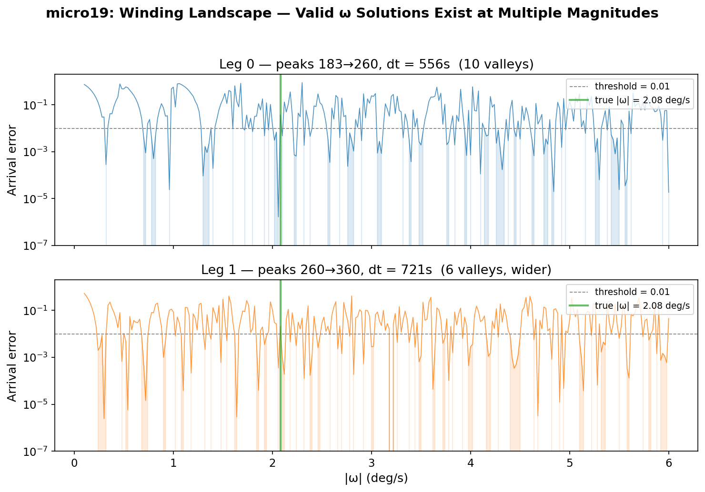
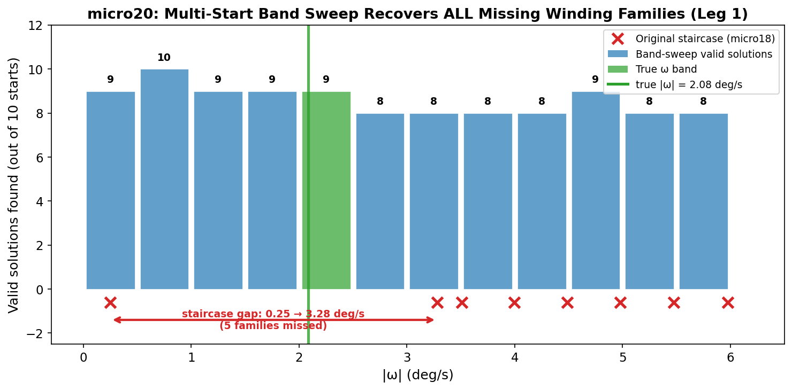
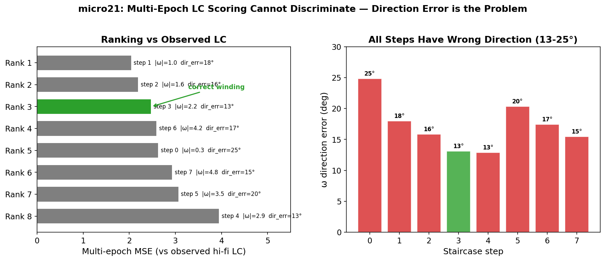
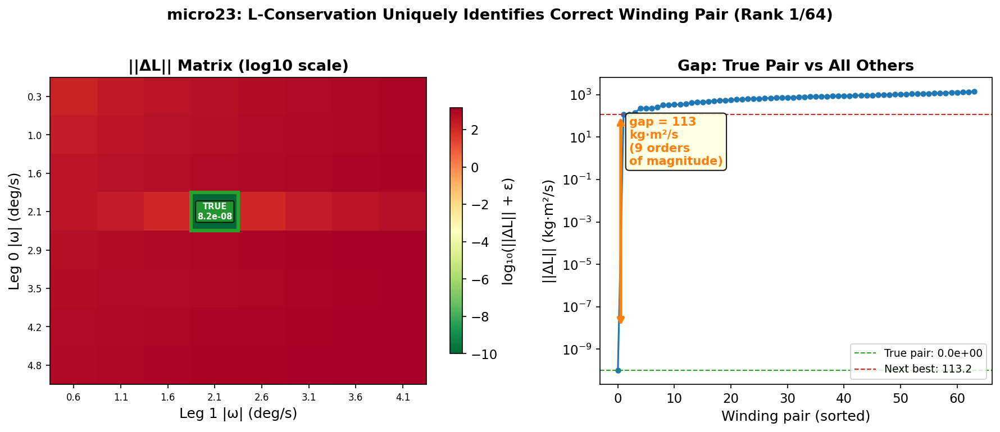
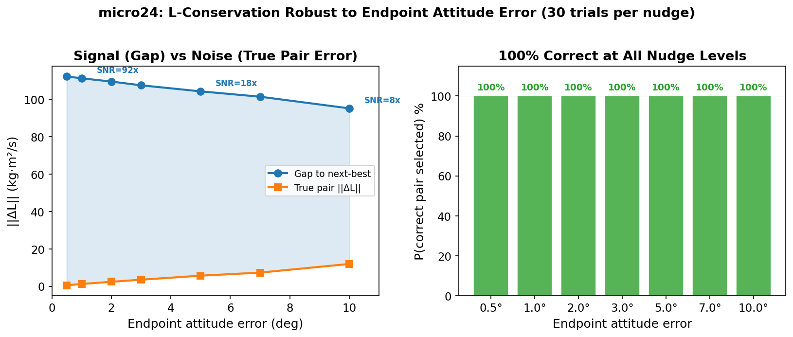
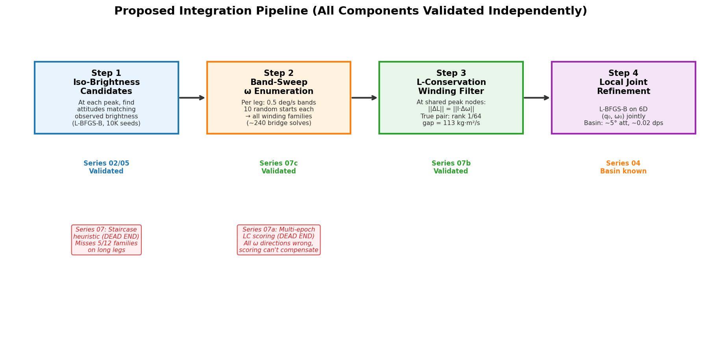

# Series 07 Findings Report: Winding Ambiguity and L-Conservation Filter

**Date:** 2026-03-11
**Branch:** `inversion_q_w`
**Experiments:** micro15b–micro25 (3 parallel investigation branches)

---

## Background

The lightcurve inversion problem seeks to recover a satellite's initial attitude (quaternion q₀) and angular velocity (ω₀) from a synthetic light curve. Previous series (00–06) established that:

- **Local optimisers converge** near truth (basin ~5° attitude, ~0.02 deg/s omega)
- **Global search on 6D space fails** — the basin is impossibly narrow for blind search
- **Peak-graph pipeline** (Series 05) generates candidate attitudes at brightness peaks and connects them via omega bridging, but **scoring fails** — lo-fi and hi-fi brightness at intermediate epochs cannot discriminate the true path from thousands of feasible alternatives

The scoring failure (micro13/14) led to Roberto's Feb 27 direction: change both the omega search strategy and the scoring signal. Series 07 explores this.

### Test Case

All experiments use the same test case:

| Parameter | Value |
|-----------|-------|
| Satellite | Intelsat 901 |
| True q₀ | axis=[0.6, 0.3, 0.8]/norm, angle=45° |
| True ω₀ | [0.5, -0.3, 2.0] deg/s ("fast tumbler") |
| \|ω₀\| | 2.083 deg/s |
| Observations | 500 epochs, dt ≈ 7.2s, window = 3600s |
| Fidelity | Lo-fi = no shadows; Hi-fi = ray-traced shadows |
| Propagation | Torque-free Euler dynamics (DOP853 ODE solver) |
| Inertia | Intelsat 901 mesh-derived tensor (triaxial, asymmetry = 0.556) |

### Peaks Used

Three brightness peaks (local magnitude minima) anchor the pipeline:

| Peak | Epoch index | Time (s) |
|------|-------------|----------|
| A | 183 | ~1321s |
| B | 260 | ~1877s |
| C | 360 | ~2598s |

These define two "legs":
- **Leg 0:** A→B, dt = 555.5s
- **Leg 1:** B→C, dt = 721.4s

---

## The Winding Ambiguity Problem

When bridging two quaternion endpoints (q_A at peak A, q_B at peak B) via the omega bridge solver, there is **not a unique solution**. Multiple angular velocities can rotate q_A to q_B in the given time — each differing by roughly one full revolution. This multiplicity is the "winding ambiguity," analogous to the non-uniqueness of rotation angles modulo 2π. Each valid solution is an **ω candidate** for that leg.

### micro17: Staircase Discovery

**Setup:** Starting from the minimum-|ω| bridge solution for leg 0 (A→B), sequentially find higher-winding solutions by setting the previous |ω| as a lower bound and using a heuristic initial guess: `ω_prev + (2π/dt) × rotation_axis`.

**Optimiser:** L-BFGS-B with barrier penalties for magnitude bounds, minimising arrival error ||q_propagated(ω, dt) - q_B||.

**Result:** 8 distinct ω candidates found on leg 0:


| Step | \|ω\| (deg/s) | Arrival err | Trough err |
|------|---------------|-------------|------------|
| 0 | 0.316 | ~0 | 1.72 |
| 1 | 0.959 | ~0 | 0.10 |
| 2 | 1.601 | ~0 | **0.02** ← best trough |
| **3** | **2.230** | **~0** | **0.79** ← **correct ω candidate** |
| 4 | 2.883 | 0.036 | 0.04 |
| 5 | 3.509 | ~0 | 0.13 |
| 6 | 4.180 | ~0 | 1.75 |
| 7 | 4.824 | ~0 | 1.49 |

**Key finding:** All 8 ω candidates satisfy the bridge constraint (arrival error ≈ 0). The true ω (2.083 deg/s) corresponds to step 3. A single brightness trough between peaks cannot discriminate: step 2 (1.601 deg/s) scores best by coincidence.

### The Critical Failure: Staircase Gap on Leg 1

Running the same staircase on leg 1 (B→C, dt=721.4s) produced:

```
Step 0: 0.249 deg/s  ← found
Step 1: 3.279 deg/s  ← JUMPED OVER 5 FAMILIES
Step 2: 3.509 deg/s
...
```

The gap from 0.25 to 3.28 deg/s means the staircase **never found the true ω (~2.08 deg/s) on leg 1**. Without the correct ω candidate in the set, no downstream filter can recover it.

---

## Series 07c: Winding Enumeration Diagnostics

### micro19: Dense Magnitude Sweep

**Question:** How many valid ω solutions actually exist, and does the true solution exist on both legs?

**Method:** Sweep |ω| from 0.1 to 6.0 deg/s in 0.02 deg/s steps (296 bins). At each target magnitude, minimise arrival error over ω direction using Nelder-Mead in 2D spherical coordinates, 3 random starts per bin. Parallelised over 8 cores.

**Runtime:** 434s (~7 min)



**Results:**

| Leg | Valleys found | Valley near true ω? | Min arrival error |
|-----|--------------|---------------------|-------------------|
| Leg 0 (dt=556s) | 10 | Yes (center 2.03 deg/s) | 1.7×10⁻⁶ |
| Leg 1 (dt=721s) | 6 | **Yes** (center 2.40 deg/s, spans 1.8–3.0) | 3.8×10⁻¹¹ |

**Interpretation:** The true ω solution **exists on both legs**. The leg 1 gap is a search failure of the staircase heuristic, not missing physics. Leg 1 has fewer but wider valleys — the longer propagation time (721s vs 556s) changes the landscape structure.

### micro20: Multi-Start Band Sweep (The Fix)

**Question:** Can a different search strategy reliably find all winding families on leg 1?

**Method:** Divide [0, 6.5] deg/s into 0.5 deg/s bands. For each band, launch 10 L-BFGS-B bridge solves from random ω (random direction, random magnitude within band). Upper and lower barrier penalties confine |ω| to the band. Parallelised over 8 cores.

**Runtime:** 957s (~16 min)



**Results:** All 12 bands contain valid solutions (8–10 out of 10 starts succeed). The original staircase missed 5 entire winding families at 0.7, 1.2, 1.9, 2.4, and 2.7 deg/s.

**Root cause of staircase failure:** The heuristic `ω_prev + (2π/dt) × rotation_axis` assumes the rotation axis is constant across winding numbers. Under Euler dynamics with triaxial inertia (IS-901 asymmetry = 0.556), the axis shifts with |ω|. On leg 1's longer dt (721s), this causes the initial guess to land in a distant basin, skipping 5 consecutive families.

**Conclusion:** Replace the sequential staircase with a magnitude-band sweep. Cost: ~240 bridge solves total (12 bands × 10 starts × 2 legs), ~10 min on 8 cores. Embarrassingly parallel and robust.

---

## Series 07a: Multi-Epoch LC Shape Scoring (Dead End)

### micro21: Core Test

**Question:** Can evaluating brightness at ALL intermediate epochs between peaks (not just one trough) discriminate the correct ω candidate?

**Setup:** Take the 8 staircase solutions from micro17 (leg 0, A→B). For each, propagate q_A with the staircase ω through all 78 intermediate epochs (183–260). Compute lo-fi brightness at each epoch. Score by MSE against: (a) observed hi-fi+noise LC, (b) lo-fi reference LC (eliminates shadow mismatch).

**Optimiser:** None — this is a scoring/ranking experiment on pre-computed staircase ω vectors.



**Ranking vs observed LC:**

| Rank | Step | \|ω\| (deg/s) | ω dir error | MSE |
|------|------|---------------|-------------|-----|
| 1 | 1 | 0.959 | 18.0° | 2.05 |
| 2 | 2 | 1.601 | 15.8° | 2.20 |
| **3** | **3** | **2.230** | **13.1°** | **2.48** |
| 4 | 6 | 4.180 | 17.4° | 2.60 |

Correct ω candidate ranks **#3/8**. Against the lo-fi reference (no shadow mismatch), it drops to **#5/8** — removing shadows makes it *worse*.

**Root cause:** All 8 staircase ω vectors have the wrong direction (13–25° off). The bridge constrains only the two endpoints, not the rotation axis between them. The staircase explores ω along `rotvec(q_A⁻¹·q_B)/dt`, which points in a different direction than the true ω at peak A. With 13° direction error and |ω| ≈ 2 deg/s, the cumulative attitude error at midpoint is ~40°, making predicted brightness completely wrong for **all** windings.

### micro22a: Nudge Robustness

**Question:** Is the ranking sensitive to endpoint attitude error?

**Method:** Apply random rotations of 1°, 3°, 5° to q_A before propagating. 5 trials per nudge level.

**Result:** Ranking is remarkably stable — correct step stays at rank ~3 for nudges up to 3°. Attitude precision is not the bottleneck.

**Conclusion:** Multi-epoch brightness scoring IS discriminating between ω candidates (MSE range 2.0–4.0), but **none match the observed LC** because the rotation axis is wrong for all of them. This approach would work if the ω direction were correct. It is a dead end as currently formulated.

---

## Series 07b: L-Conservation ω Candidate Filter (Strong Positive)

### The Idea

Angular momentum is conserved in torque-free motion:

```
L = R(q) · (I · ω_body) = constant in inertial frame
```

At a shared peak node (e.g., peak B), the arriving ω from leg 0 and the departing ω for leg 1 must produce the same L. Different ω candidate pairs produce different L values — only the correct pair matches.

### micro23: Oracle L-Consistency Test

**Question:** With oracle attitudes and the true ω injected into both legs' candidate sets, does L-conservation identify the correct ω candidate pair?

**Setup:** 8 ω candidates per leg (from micro17 staircase on leg 0, evenly-spaced candidates on leg 1). Each pair (k, j) evaluated by:
- `||ΔL|| = ||L_arriving_leg0(k) - L_departing_leg1(j)||`
- `|ΔT| = |T_leg0(k) - T_leg1(j)|` (kinetic energy check)



**Result:**

| Metric | True pair (3,3) | Next-best | Gap |
|--------|----------------|-----------|-----|
| \|\|ΔL\|\| | 8.2×10⁻⁸ kg·m²/s | 113.2 kg·m²/s | **9 orders of magnitude** |
| \|ΔT\| | 8.3×10⁻¹⁰ | 0.34 | 8 orders of magnitude |

The true pair is ranked **#1 out of 64** with an enormous gap. Kinetic energy T provides no additional discrimination beyond L (redundant). The pattern in the heatmap is clean and monotonic — wrong ω candidates produce L-errors proportional to their distance from the true ω.

### micro24: Nudge Sensitivity

**Question:** How much attitude error can L-consistency tolerate?

**Setup:** Two parts:
- **Part A:** Nudge the shared node attitude (q_mid at peak B).
- **Part B:** Nudge endpoint attitudes (q_A, q_C). 30 random trials per nudge level (0.5°–10°).

**Part A result:** **Completely invariant.** This is a mathematical identity:

```
||ΔL|| = ||R(q_mid) · I · (ω_arr - ω_dep)|| = ||I · (ω_arr - ω_dep)||
```

Since R(q) is orthogonal and the same R appears in both L vectors, it cancels. L-consistency is equivalent to checking body-frame omega matching weighted by inertia. Shared-node attitude errors are irrelevant.

**Part B result:**



| Endpoint nudge | P(correct) | Gap (kg·m²/s) | True pair \|\|ΔL\|\| | SNR |
|----------------|------------|----------------|---------------------|-----|
| 0.5° | 100% | 112.3 | 0.53 | 212× |
| 1.0° | 100% | 111.3 | 1.21 | 92× |
| 2.0° | 100% | 109.6 | 2.39 | 46× |
| 5.0° | 100% | 104.3 | 5.67 | 18× |
| 10.0° | 100% | 95.2 | 11.9 | 8× |

**100% correct at all nudge levels** (210 total trials). True pair ||ΔL|| grows linearly at ~1.2 kg·m²/s per degree of endpoint error, but the gap degrades slowly from 113 to 95. Even at 10° endpoint error, the SNR is 8×.

**Why so robust?** The winding spacing creates an L-gap of ~2π·||I||/dt per winding number. The attitude-error-induced noise is ~||I||·δq/dt. The SNR ≈ 2π/δq is independent of leg duration. For δq = 10°: SNR ≈ 2π/0.175 ≈ 36×.

### micro25: Three-Leg Extension

**Question:** Does a 3rd leg (4 peaks) improve discrimination?

**Setup:** Found a 4th peak at epoch 15. Three legs with 8 ω candidates each → 512 triples. Score = ||ΔL_B|| + ||ΔL_C|| at two shared nodes.

**Result:** True triple ranks 1/512. The 3rd leg provides redundancy but was not needed — 2 legs already achieve perfect discrimination.

---

## Synthesis: What We Learned

### Dead Ends

1. **Sequential staircase heuristic (micro17/18):** The heuristic `ω_prev + (2π/dt) × axis` fails on longer legs because the Euler dynamics rotation axis shifts with |ω|. Missed 5 of 12 winding families on leg 1.

2. **Multi-epoch LC shape scoring (micro21/22a):** All staircase ω candidates have 13–25° direction error. The bridge constrains endpoints only, not the rotation axis. Scoring at intermediate epochs IS discriminating between ω candidates, but **none** match the observed LC because the axis is wrong for all of them. Not a fidelity issue.

3. **Single trough scoring (micro16/16b):** A single brightness dip between peaks has insufficient discriminating power. Step 2 scored best by coincidence; true ω candidate ranked 65/101 on leg 0, 36/101 on leg 1.

4. **Minimum-|ω| strategy (micro15b):** The min-|ω| bridge solution is always the slowest ω candidate (~0.3 deg/s), which is far from the true ω (2.08 deg/s). No value of the regularisation parameter α changes this.

### Breakthroughs

1. **Band-sweep winding enumeration (micro19/20):** All winding families can be found reliably by dividing the magnitude range into 0.5 deg/s bands and running 10 random-start L-BFGS-B solves per band. Cost: ~240 bridge solves (~10 min on 8 cores). Embarrassingly parallel.

2. **L-conservation as ω candidate filter (micro23/24/25):** Angular momentum conservation uniquely identifies the correct ω candidate pair with 9 orders of magnitude separation. Robust to 10° endpoint attitude error (100% correct, 210 trials). Shared-node error is mathematically irrelevant (R cancels). Two legs sufficient; three provide redundancy.

### The Critical Insight

The omega bridge connects two attitude endpoints but produces multiple ω candidates (one per winding number). These candidates differ in both |ω| and direction. Previous approaches tried to distinguish them using brightness (scored poorly due to direction error). L-conservation bypasses brightness entirely — it uses the physics of angular momentum conservation, which creates a gap proportional to ||I|| × 2π/dt between adjacent ω candidates. This gap is enormous compared to any realistic attitude estimation error.

---

## Proposed Integration Pipeline



| Step | Input | Method | Output | Validated by |
|------|-------|--------|--------|-------------|
| 1. Iso-brightness candidates | Observed LC | L-BFGS-B with 10K seeds per peak | ~5,000 attitudes per peak (~1° from truth) | Series 02/05 |
| 2. Band-sweep ω enumeration | Candidate pairs (q_A, q_B) per leg | 12 bands × 10 random starts, L-BFGS-B bridge | ~8–12 ω candidates per leg | Series 07c (micro19/20) |
| 3. L-conservation filter | All (leg 0 ω, leg 1 ω) candidate pairs | ||ΔL|| at shared peak nodes | Top-1 pair (9 OOM gap) | Series 07b (micro23/24/25) |
| 4. Local joint refinement | Best (q₀, ω₀) estimate | L-BFGS-B on full 6D, hi-fi evaluation | Final (q₀, ω₀) | Series 00/04 (basin known) |

### Open Question

The pipeline is validated independently with oracle and near-oracle data. The **next experiment** must test the integration end-to-end with non-oracle attitude candidates (~1–2° from truth) from the iso-brightness stage. The key question: does the pipeline work when the input attitudes come from Step 1 rather than from the ground truth?

---

## Appendix: Experiment Cross-Reference

| Experiment | Series | Question | Outcome |
|------------|--------|----------|---------|
| micro15b | 07 | Does min-\|ω\| with α regularisation find correct ω candidate? | No — always lands on lowest ω candidate |
| micro16 | 07 | Does single-trough brightness discriminate ω candidates (leg 0)? | No — true rank 65/101 |
| micro16b | 07 | Same on leg 1? | No — true rank 36/101 |
| micro17 | 07 | Can staircase enumerate ω candidates? | Yes on leg 0 (8 found), fails on leg 1 |
| micro19 | 07c | How many valid ω candidates exist? | Leg 0: 10 valleys, Leg 1: 6 valleys |
| micro20 | 07c | Can multi-start band sweep find all? | Yes — all 12 bands have ω candidates |
| micro21 | 07a | Does multi-epoch lo-fi MSE discriminate ω candidates? | No — correct ranks #3/8 (direction error) |
| micro22a | 07a | Is ranking stable under attitude nudge? | Stable but wrong (rank ≈ 3, never 1) |
| micro23 | 07b | Does L-conservation identify correct ω candidate pair (oracle)? | Yes — rank 1/64, gap = 113 |
| micro24 | 07b | Robust to 0.5–10° endpoint error? | 100% correct, all 210 trials |
| micro25 | 07b | Does 3rd leg help? | Rank 1/512, but 2 legs sufficient |
