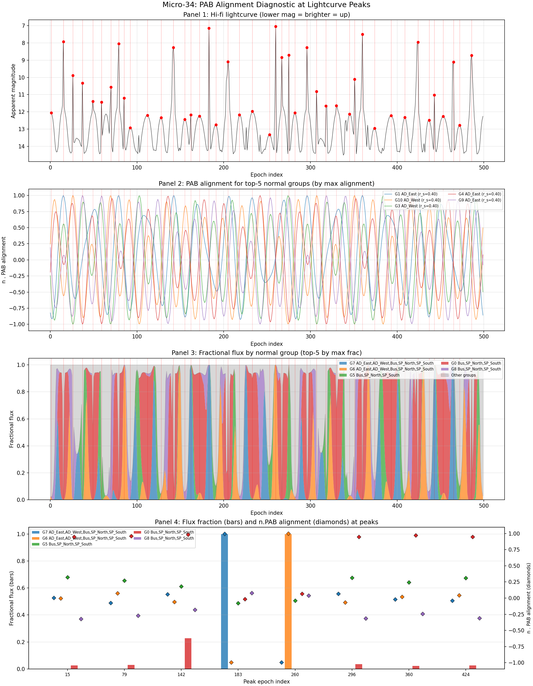

# Series 09 Findings Report: Specular Glint Analysis and PAB Alignment

**Date:** 2026-03-12
**Branch:** `inversion_q_w`
**Experiments:** micro34 (PAB alignment diagnostic)

---

## Background

The lightcurve inversion problem seeks to recover a satellite's initial attitude (quaternion q0) and angular velocity (omega0) from a synthetic light curve. Previous series established that:

- **Local optimisers converge** near truth (basin ~5 deg attitude, ~0.02 deg/s omega), but the basin is too narrow for global search (Series 00-01)
- **Peak-anchored candidate generation** at brightness peaks, followed by omega bridging and L-conservation filtering, is the most promising pipeline architecture (Series 05-08)
- **Bridge solver coverage** is the current bottleneck: the solver cannot reliably find the true omega direction on longer legs with limited random starts (Series 08)

All of these approaches treat brightness peaks as opaque anchor points: "find attitudes that produce the right brightness value." But they never ask *why* a peak occurs. This series investigates the physical mechanism behind brightness peaks and asks whether that mechanism provides additional geometric constraints for attitude recovery.

### The Physical Hypothesis

The Ashikhmin-Shirley BRDF used in the forward model has a specular term that peaks when the facet normal **n** aligns with the half-vector:

```
h = (k1 + k2) / |k1 + k2|
```

where k1 is the sun direction and k2 is the observer direction, both in the body frame. This half-vector is the **Phase Angle Bisector (PAB)**. When n . h approaches 1, the specular contribution from that facet can dominate total brightness by orders of magnitude, producing a sharp "glint" in the lightcurve.

If brightness peaks are indeed specular glints driven by single-facet PAB alignment, this has profound implications for inversion:

1. Each glint constrains the attitude quaternion to a 1-DOF circle on SO(3) (the set of rotations that align a known facet normal with the known inertial-frame PAB direction)
2. Combined with a brightness magnitude constraint, the solution set becomes discrete
3. If the glinting component can be identified (from glint shape, duration, or intensity), the constraint becomes even stronger

This experiment tests the hypothesis.

### Test Case

All experiments use the standard test case:

| Parameter | Value |
|-----------|-------|
| Satellite | Intelsat 901 |
| True q0 | axis=[0.6, 0.3, 0.8]/norm, angle=45 deg |
| True omega0 | [0.5, -0.3, 2.0] deg/s ("fast tumbler") |
| \|omega0\| | 2.083 deg/s |
| Observations | 500 epochs, dt ~ 7.2s, window = 3600s |
| Fidelity | Hi-fi (ray-traced shadows) |
| Propagation | Torque-free Euler dynamics (DOP853 ODE solver) |
| Inertia | Intelsat 901 mesh-derived tensor (triaxial, asymmetry = 0.556) |
| Articulation | Fixed: SP at 0 deg, AD at 15 deg |

---

## Experimental Setup

### micro34: PAB Alignment Diagnostic

**Script:** `notebooks/inversion/09_glint_analysis/micro34_pab_alignment.py`

**Procedure:**

1. **Facet grouping.** Extract all 3840 facet normals from the Intelsat 901 mesh after applying fixed articulation (solar panels at 0 deg, antennas at 15 deg). Round normals to 4 decimal places and find unique directions. This groups coplanar facets on the same flat face into a single "normal group."

2. **Normal group metadata.** For each of the resulting 14 unique normal groups, record: the normal vector, which satellite component(s) contain facets with that normal, total surface area, and BRDF specular parameters (r_s and n_phong).

3. **Body-frame vectors.** At each of the 500 epochs, compute the sun direction k1 and observer direction k2 in the body frame using the true attitude quaternion at that epoch. These are obtained by rotating the SPICE-derived inertial-frame vectors via R(q), where q is from the propagated true attitude trajectory.

4. **PAB alignment.** At each epoch, compute PAB_body = (k1 + k2) / |k1 + k2|, then evaluate the dot product n . PAB for each of the 14 unique normal groups. This gives a (14 x 500) alignment matrix.

5. **Peak detection.** Find brightness peaks as local minima of the hi-fi magnitude array using `scipy.signal.argrelmin` with order=5 (requires the peak to be a minimum within +/-5 epochs). This detected 43 peaks across the 500-epoch window.

6. **Per-facet flux decomposition.** Re-run the hi-fi forward model with `animate=True` to capture per-facet flux at every epoch. Sum per-facet flux by normal group to obtain the fractional flux contribution of each group at every epoch: `frac_flux[g, i] = sum(flux of facets in group g at epoch i) / total_flux[i]`. This decomposition is performed in linear flux space, not in magnitude (log) space, since magnitudes are not additive.

**Runtime:** 116.3s total (57.9s for hi-fi shadow computation).

---

## Results

### Satellite Geometry: 14 Unique Normal Groups

The Intelsat 901 model, after fixed articulation, has only 14 distinct facet-normal directions across its 3840 triangular facets. The groups span the satellite's 5 components (Bus, SP_North, SP_South, AD_East, AD_West) and are summarised in the table below, ordered by total surface area:

| Group | Normal direction | Components | Area (m^2) | r_s | n_phong | Physical face |
|-------|-----------------|------------|-----------|-----|---------|---------------|
| 0 | [-1, 0, 0] | Bus, SP_N, SP_S | 97.3 | 0.37 | 267 | -X face (bus broadside + panels) |
| 13 | [+1, 0, 0] | Bus, SP_N, SP_S | 97.3 | 0.37 | 267 | +X face (bus broadside + panels) |
| 6 | [0, 0, -1] | All 5 | 22.8 | 0.38 | 240 | -Z face (top/bottom) |
| 7 | [0, 0, +1] | All 5 | 22.8 | 0.38 | 240 | +Z face (top/bottom) |
| 5 | [0, -1, 0] | Bus, SP_N, SP_S | 16.9 | 0.37 | 267 | -Y face (bus side) |
| 8 | [0, +1, 0] | Bus, SP_N, SP_S | 16.9 | 0.37 | 267 | +Y face (bus side) |
| 1 | [-0.97, -0.26, 0] | AD_East | 9.8 | 0.40 | 200 | AD_East main face |
| 2 | [-0.97, +0.26, 0] | AD_West | 9.8 | 0.40 | 200 | AD_West main face |
| 11 | [+0.97, -0.26, 0] | AD_West | 9.8 | 0.40 | 200 | AD_West rear face |
| 12 | [+0.97, +0.26, 0] | AD_East | 9.8 | 0.40 | 200 | AD_East rear face |
| 3 | [-0.26, -0.97, 0] | AD_West | 1.1 | 0.40 | 200 | AD_West side face |
| 4 | [-0.26, +0.97, 0] | AD_East | 1.1 | 0.40 | 200 | AD_East side face |
| 9 | [+0.26, -0.97, 0] | AD_East | 1.1 | 0.40 | 200 | AD_East side face |
| 10 | [+0.26, +0.97, 0] | AD_West | 1.1 | 0.40 | 200 | AD_West side face |

The two broadside faces (+/-X) dominate by area (97.3 m^2 each, 384 facets). The antenna dish faces are 10x smaller (9.8 m^2) but have slightly higher specular reflectivity (r_s = 0.40 vs 0.37). The antenna side faces are tiny (1.1 m^2 each).

### Main Finding: Brightness Peaks Are Specular Glints

The 4-panel diagnostic plot summarises the results:



- **Panel 1 (top):** Hi-fi lightcurve with detected peaks marked in red.
- **Panel 2:** n . PAB alignment traces for the top-5 normal groups. Alignment oscillates as the satellite tumbles, and spikes to near 1.0 coincide with brightness peaks.
- **Panel 3:** Stacked fractional flux. At glint epochs, a single color fills the entire bar, showing one facet group dominates.
- **Panel 4:** Decomposition at the 8 most prominent peaks. Bars show fractional flux; diamonds show n . PAB alignment.

### Two Distinct Brightness Regimes

The 43 detected peaks fall into two clearly different categories:

**Specular glints (mag < 9): 11 peaks**

At every bright peak (magnitude below 9), a single normal group captures >77% of total flux (and typically >96%), with n . PAB alignment > 0.99. These are unambiguous specular glints where one flat face reflects sunlight nearly perfectly toward the observer.

| Peak | Mag | Dominant group | Component | Frac flux | n . PAB | Area (m^2) |
|------|-----|---------------|-----------|-----------|---------|-----------|
| 183 | 7.15 | G7 [0, 0, +1] | All (z-face) | 1.0000 | 0.997 | 22.8 |
| 260 | 7.04 | G6 [0, 0, -1] | All (z-face) | 1.0000 | 0.997 | 22.8 |
| 360 | 7.50 | G1 [-0.97, -0.26, 0] | AD_East | 0.9764 | 1.000 | 9.8 |
| 15 | 7.94 | G1 [-0.97, -0.26, 0] | AD_East | 0.9727 | 0.998 | 9.8 |
| 79 | 8.04 | G1 [-0.97, -0.26, 0] | AD_East | 0.9684 | 0.997 | 9.8 |
| 424 | 7.96 | G1 [-0.97, -0.26, 0] | AD_East | 0.9724 | 0.998 | 9.8 |
| 296 | 8.27 | G1 [-0.97, -0.26, 0] | AD_East | 0.9629 | 0.996 | 9.8 |
| 142 | 8.27 | G1 [-0.97, -0.26, 0] | AD_East | 0.7716 | 0.995 | 9.8 |
| 275 | 8.72 | G5 [0, -1, 0] | Bus, SP | 0.9997 | 0.994 | 16.9 |
| 486 | 8.72 | G0 [-1, 0, 0] | Bus, SP | 0.9954 | 0.986 | 97.3 |
| 267 | 8.85 | G2 [-0.97, +0.26, 0] | AD_West | 0.9385 | 0.993 | 9.8 |

The three peaks used in the existing inversion pipeline (epochs 183, 260, 360) are among the brightest and most clearly identified as single-facet glints.

**Diffuse peaks (mag > 11): 25 peaks**

Dimmer peaks are dominated by the large bus broadside faces (G0/G13, 97.3 m^2 each), which produce moderate brightness through sheer area rather than specular concentration. At these epochs, no normal has near-perfect PAB alignment (typical n . PAB = 0.6-0.9), and multiple groups contribute non-negligibly. These are the broad, gentle undulations between glints.

| Peak | Mag | Dominant group | Frac flux | n . PAB |
|------|-----|---------------|-----------|---------|
| 253 | 13.31 | G13 [+1, 0, 0] Bus | 0.699 | 0.514 |
| 92 | 12.92 | G13 [+1, 0, 0] Bus | 0.826 | 0.614 |
| 374 | 12.95 | G13 [+1, 0, 0] Bus | 0.830 | 0.612 |
| 112 | 12.21 | G0 [-1, 0, 0] Bus | 0.918 | 0.809 |

**Mid-range peaks (mag 9-11): 7 peaks**

These are transitional — some are specular-driven (small antenna faces with near-perfect alignment), others are area-driven (bus faces with moderate alignment).

### Quantitative Statistics

| Metric | Value |
|--------|-------|
| Correlation(max n.PAB, total flux) | 0.271 |
| Mean max(n . PAB) at all epochs | 0.865 |
| Mean max(n . PAB) at peaks | 0.939 |
| Peaks where top-flux group = top-alignment group | 23/43 (53.5%) |

The overall correlation between max(n . PAB) and total flux is only 0.27. This is expected: total flux depends on `area x BRDF(alignment)`, not alignment alone. The large bus faces (97.3 m^2) produce substantial diffuse flux even at moderate alignment, while small antenna faces (1.1-9.8 m^2) only dominate when alignment is near-perfect.

The 53.5% match rate (top-flux group equals top-alignment group) reflects the two regimes: at specular glints the match is nearly always perfect, while at diffuse peaks the largest face wins on area even though a smaller face may have higher alignment.

### The Specular Concentration Effect

The most striking result is the magnitude of spectral concentration. The AD_East main face (Group 1, 9.8 m^2, r_s = 0.40, n_phong = 200) produces glints at magnitude 7.5-8.3 when it achieves near-perfect PAB alignment. This is **brighter than anything the 97.3 m^2 bus broadside produces diffusely** (typically magnitude 11-13).

The ratio is dramatic: a 10x smaller face producing >100x more flux (4-5 magnitudes brighter). This is the specular concentration factor at work. With n_phong = 200, the specular lobe width is approximately `sqrt(2/n_phong)` ~ 6 deg. When n . PAB > 0.99 (alignment within ~8 deg), essentially all incident light is reflected into the narrow specular cone toward the observer.

Even the tiny antenna side faces (Group 9, 1.1 m^2) can dominate total flux at >90% when achieving near-perfect alignment, producing peaks at magnitude 10-11.

---

## Assumptions and Limitations

1. **Oracle attitudes.** This experiment uses the true attitude quaternion at every epoch to compute body-frame vectors. In the actual inversion problem, q is unknown. The PAB direction is known in the inertial frame (from SPICE), but the body-frame PAB — and hence the n . PAB alignment — depends on q.

2. **Fixed articulation.** Solar panels are fixed at 0 deg and antennas at 15 deg. In a real observation, articulation angles may be unknown. Articulated components would have time-varying normals, complicating the analysis but also providing additional constraints.

3. **Single test case.** Only one attitude trajectory (one q0, one omega0) was tested. The specific peaks, their timing, and which components produce them will change with different initial conditions. The underlying physics (glints occur when n . PAB ~ 1) is universal.

4. **Flat-face approximation.** The satellite model consists entirely of flat triangulated faces. Real satellites may have curved reflectors that produce broader, potentially asymmetric glint profiles. The discrete normal direction structure (only 14 unique directions for IS-901) is a consequence of the flat-face model.

5. **No noise.** The analysis uses the true (noiseless) hi-fi lightcurve. The observed lightcurve includes noise (sigma = 0.05 mag), which would affect peak detection at dim peaks but should not affect the prominent glints (which are 4-5 magnitudes above the diffuse background).

6. **BRDF model fidelity.** The Ashikhmin-Shirley BRDF is a physically motivated but simplified model. Real satellite surface interactions may include diffraction, multiple reflections, and wavelength-dependent effects not captured here.

---

## Implications for Inversion

### 1. Glint-Based Attitude Constraint

At a specular glint epoch, the constraint is:

```
R(q) @ n_body ~ PAB_inertial
```

where n_body is the normal of the glinting facet (known from the satellite model) and PAB_inertial is the phase angle bisector in the inertial frame (known from SPICE). This constrains q to a 1-DOF circle on SO(3) — the set of rotations about the PAB axis that keep n_body aligned with PAB_inertial.

For a satellite with only 14 unique normals, identifying which facet is glinting produces 14 candidate circles. Intersecting with a brightness constraint (the iso-brightness surface from the current pipeline) could dramatically reduce the candidate set.

Two glints at different epochs from two different components, combined with the omega bridge constraint, could in principle yield a discrete set of (q, omega) candidates — far smaller than the current approach of 5000+ iso-brightness candidates per peak.

### 2. Component Identification from Glint Properties

The data shows that different components produce qualitatively different glints:

- **AD_East main face** (9.8 m^2, r_s = 0.40, n_phong = 200): Produces the most frequent glints (5 of 11 bright peaks). Sharp, recurring with period ~65 epochs (~470s), magnitude 7.5-8.3.
- **z-faces** (22.8 m^2, r_s = 0.38, n_phong = 240): Produce the absolute brightest glints (mag 7.0-7.2) with 100% flux dominance. Higher n_phong means a narrower specular lobe, concentrating more light.
- **Bus broadside** (97.3 m^2, r_s = 0.37, n_phong = 267): Rarely produces specular glints (only epoch 486 among the bright peaks). Dominates at dimmer diffuse peaks instead.

These signatures — glint intensity, frequency, and which component drives them — are in principle distinguishable from the lightcurve shape. A more detailed study of glint profiles (rise time, peak width, decay shape) could enable component identification without knowing the attitude.

### 3. Articulation Awareness

If a solar panel rotates, its normal direction in the body frame changes. This means the same panel at different articulation angles produces glints at different satellite attitudes. For a given inertial PAB direction, the constraint `R(q) @ R_art(theta) @ n_panel = PAB_inertial` introduces the articulation angle theta as an additional unknown. However, the glint timing and shape would change with theta, providing a constraint on the articulation state as well.

### 4. Practical Next Steps

The immediate next experiment should test whether the glint constraint can be exploited computationally:

- **micro35:** At glint epochs, enumerate candidate attitudes by requiring that one of the 14 normals aligns with the known inertial PAB direction (within the specular lobe width). Compare the size and distribution of this candidate set to the current iso-brightness candidate set (5000+ candidates from 10K random seeds). If the glint-based set is substantially smaller, it could replace or augment Block 1 of the inversion pipeline.

- **micro36:** Test component identification: can a simple heuristic (glint brightness, duration, recurrence period) distinguish which of the 14 normals is responsible for a given peak, without knowing the attitude?

---

## Summary

| Finding | Evidence | Implication |
|---------|----------|-------------|
| Bright peaks (mag < 9) are specular glints | 11/11 have a single group with >77% flux and n . PAB > 0.99 | Each glint constrains q to a 1-DOF circle |
| Dim peaks (mag > 11) are diffuse | Dominated by large bus faces at moderate alignment | Less useful for attitude constraint |
| Only 14 unique normal directions | IS-901 flat-face geometry | Candidate facet search is tiny |
| Small faces produce the brightest events | AD_East (9.8 m^2) outshines 97.3 m^2 bus by 4-5 mag | Specular concentration factor is enormous |
| Different components have different glint signatures | AD_East: frequent, moderate. z-faces: rare, brightest. Bus: diffuse only | Component identification may be feasible |

The central result is that brightness peaks in the Intelsat 901 lightcurve are not mysterious: they are specular glints, each caused by a single identifiable facet group achieving near-perfect alignment with the phase angle bisector. This geometric interpretation transforms each glint from a scalar brightness measurement into a directional constraint on the attitude quaternion, and opens a path toward component-aware inversion.
