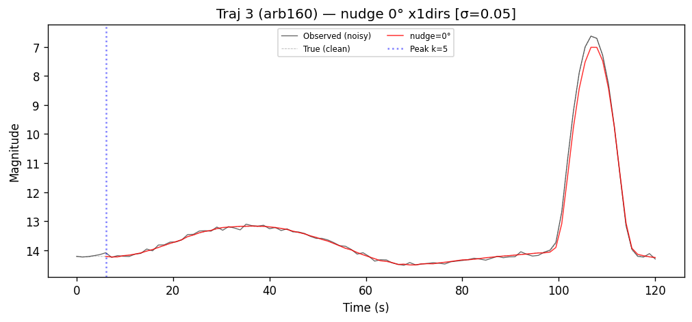
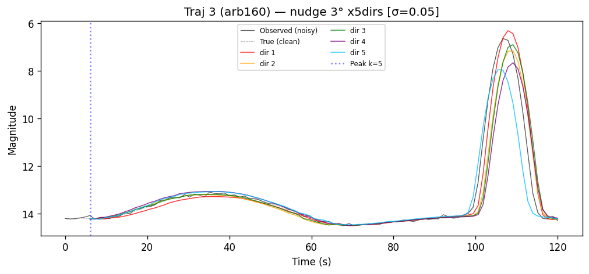
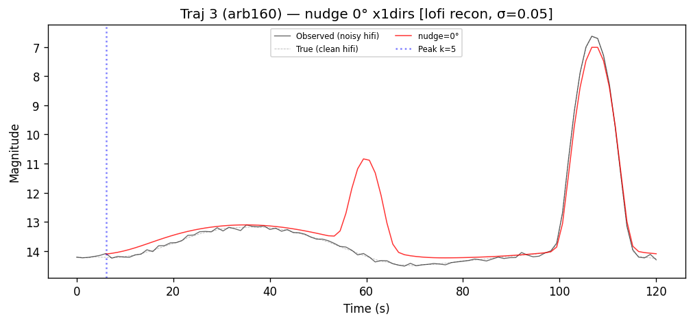
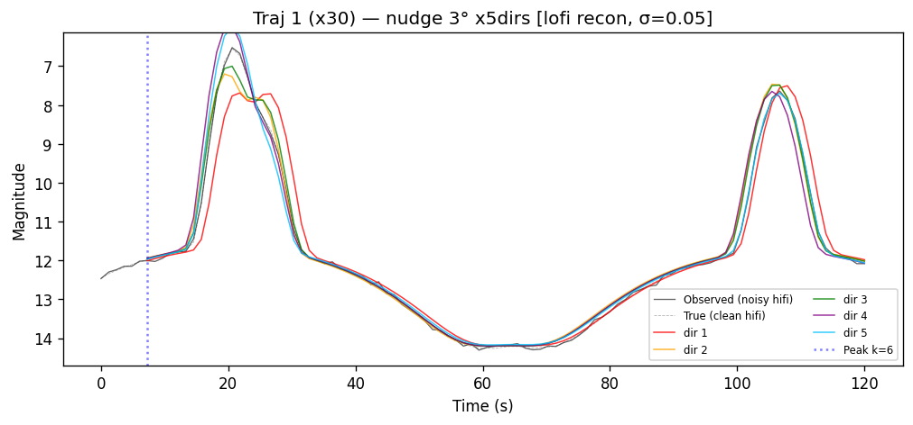

# Winding Ambiguity in $\boldsymbol{\omega}$ Bridging
### Weekly Update — 10 March 2026

Girish Narayanan

---

## Where We Left Off

Full graph pipeline: 50 candidates × 3 brightness peaks, shortest-path graph search.

| Stage | Result |
|---|---|
| Candidate generation | 1,400–2,987 hits/peak from 1M random samples |
| Bridge feasibility | 98.5% feasible — 3 free $\boldsymbol{\omega}$ DOF connects almost any pair |
| Lo-fi intermediate scoring | Truth bridge indistinguishable from random |
| Hi-fi rescoring | **Truth ranked #13,979 / 121,326** |

**Your prescription:** (1) search for the *minimum*-$|\boldsymbol{\omega}|$ bridge; (2) explore the winding family; (3) score by trough brightness rather than intermediate epochs.

---

## Root Cause: Winding Degeneracy

A fast tumbler bridges two peaks over $\Delta t = 554\text{s}$ at $|\boldsymbol{\omega}| \approx 2.08°/\text{s}$ — roughly **3 full rotations**.

The axis-angle estimate assumes the *shortest arc* — zero extra loops.

| | True $\boldsymbol{\omega}$ | Axis-angle bridge |
|---|---|---|
| Magnitude | 2.08 °/s | 0.32 °/s |
| Winding number | ~3 | ~0 |
| Arrival mismatch | — | 0.0° ✓ |
| Intermediate trajectory | Correct | **Completely wrong** |

**The solver finds a trajectory 8× too slow — yet arrives at exactly the right attitude.**
Arrival matching alone cannot distinguish winding numbers.

---

## Why This Killed the Graph Pipeline

At intermediate epochs, all feasible bridges predict *some* attitude — but if the winding number is wrong, that attitude is completely wrong. No scoring signal survives.

- Lo-fi intermediate scoring → scores uniform across all paths
- Hi-fi rescoring → same problem: the bridge $\boldsymbol{\omega}$ itself has the wrong winding

**The fix must happen inside the bridge optimisation, not in the scoring step.**

---

## Omega Recovery: Exact Attitudes Work Perfectly

Given exact quaternion endpoints, recovering $\boldsymbol{\omega}$ is trivial and cheap.

| Metric | Value |
|---|---|
| Cost per bridge solve | ~160 ms (L-BFGS-B, 44 evals) |
| Omega error at zero nudge | < 0.000001 °/s |
| Parallelism | 2,500 pairs in ~3 min on 8 cores |

**Bridging is not the bottleneck. The problem is endpoint quality.**

---

## Hi-fi: Attitude Error Is Anisotropic

3° nudge in 5 random directions, hi-fi reconstruction from the recovered $\boldsymbol{\omega}$:

On average: ~0.025 °/s omega error per degree of attitude error.
But **direction matters** — at the glint peak (t ≈ 107s), some directions produce near-perfect reconstructions while others shift the peak by >2 mag.

*The same 3° candidate error can be benign or catastrophic depending on which direction it points.*

---

## Lo-fi: Phantom Peaks From Self-Shadowing

Lo-fi reconstruction with **zero attitude error** — the omega is perfectly recovered:

**Lo-fi predicts a bright glint at t ≈ 60s that does not exist in the hi-fi observations.**
This orientation (arbitrary 160° rotation) puts a component in self-shadow at that epoch — hi-fi sees darkness, lo-fi sees a glint. The MSE between lo-fi and hi-fi is large *at truth*, making lo-fi scoring structurally unreliable.

---

## Lo-fi Failure Is Orientation-Dependent

Same 3° nudge, lo-fi reconstruction, different starting orientation (30° about x):

No spurious peak. Lo-fi and hi-fi agree well. The failure in the previous slide is not a general property of lo-fi — it occurs *specifically* at orientations with active self-shadowing.

**Implication:** we cannot know a priori which candidate orientations will have lo-fi failures — so lo-fi scoring is not safe to use anywhere in the pipeline.

---

## What the Nudge Results Mean for the Pipeline

| Question | Finding |
|---|---|
| Can we recover $\boldsymbol{\omega}$ cheaply? | Yes — 160 ms, exact with exact endpoints |
| What if endpoints have 1–5° error? | ~0.025 °/s/deg on average, but direction-dependent |
| Can lo-fi MSE rank candidate pairs? | **No** — phantom peaks at some orientations make lo-fi MSE unreliable |
| How accurate do endpoints need to be? | Within ~2° for hi-fi local refinement to converge |

**Practical consequence:** the bridge solver is fine. What we need is (a) accurate endpoint attitudes and (b) hi-fi scoring — never lo-fi — to rank path families.

---

## Staircase: Enumerating the Winding Family

True pair, oracle attitudes, leg spanning 554s. Staircase finds each winding band in turn.

| Step | $|\boldsymbol{\omega}|$ (°/s) | Arrival err | Trough err |
|---|---|---|---|
| 0 | 0.316 | 0.0 | 1.719 |
| 1 | 0.959 | 0.0 | 0.099 |
| 2 | 1.601 | 0.0 | **0.021** ← best by trough |
| **3** | **2.230** | **0.0** | 0.792 ← *true* ($|\boldsymbol{\omega}|_\text{true} = 2.083°/\text{s}$) |
| 4 | 2.883 | 0.036 | 0.044 |
| 5 | 3.509 | 0.0 | 0.134 |
| 6 | 4.180 | 0.0 | 1.749 |
| 7 | 4.824 | 0.0 | 1.491 |

*8 distinct physically valid bridges. Mechanism confirmed.*

---

## Why a Single Trough Fails

Trough scoring selects step 2 (1.601 °/s). **True step is 3 (2.230 °/s).**

The trough epoch is only 202s into a 554s leg. At that early time, steps 2 and 3 produce nearly identical trajectories — the winding difference hasn't accumulated into a detectable brightness signal.

Step 2 scores best by coincidence of timing, not physics. *One checkpoint is not enough.*

Earlier attempt (axis-angle bridge only, same trough): true pair ranked 65/101.
Same root cause — the axis-angle bridge has the wrong winding (step 0), so the trough attitude is completely wrong for every pair including truth.

---

## Angular Momentum Conservation as a Filter

Torque-free dynamics conserves angular momentum:
$$\mathbf{L} = R(q)\, I\, \boldsymbol{\omega} = \text{const}$$

**Idea:** run the staircase independently on *both* legs. At the shared middle peak, only the physically consistent $(k, j)$ pair satisfies $\mathbf{L}_{\text{leg 0}}[k] = \mathbf{L}_{\text{leg 1}}[j]$.

$8 \times 8 = 64$ pairs. One minimum. No extra evaluations needed.

---

## L-Conservation Filter: Result

Ran the filter with oracle attitudes. **Result: incorrect** — identified $(k=0,\, j=0)$, true pair is $(k=3,\, j=1)$.

Root cause: **leg 1 staircase is broken.**

| | Leg 0 $|\boldsymbol{\omega}|$ (°/s) | Leg 1 $|\boldsymbol{\omega}|$ (°/s) |
|---|---|---|
| Step 0 | 0.316 | 0.249 |
| Step 1 | 0.959 | **3.279** ← gap |
| Step 2 | 1.601 | 3.509 |
| Step 3 | 2.230 | 3.995 |

Leg 0 steps uniformly at $\approx +0.65°/\text{s}$ per step. Leg 1 jumps from 0.249 to 3.279, skipping four winding bands entirely. **The L-filter idea is sound — the staircase implementation needs a fix.**

---

## The Near-$\pi$ Singularity

Leg 1 spans $\Delta t = 720\text{s}$. Its axis-angle starting estimate lands near a $\pi$-rad rotation.
The quaternion double-cover introduces a sign ambiguity; the optimiser jumps discontinuously past multiple winding bands.

**Fix:** initialise step 0 from $\boldsymbol{\omega}_0 = \mathbf{0}$ rather than the axis-angle estimate. Add a tight upper barrier ($\pm 0.4\,\delta$ per step) so each solve stays confined to one winding band. The barrier logic is already in the code — one parameter change.

---

## Next Steps

| Priority | Action | Goal |
|---|---|---|
| 1 | Fix staircase seed (zero init + tight upper barrier) | Repair leg 1 winding enumeration |
| 2 | Rerun L-conservation filter | Confirm unique minimum at true $(k, j)$ with oracle attitudes |
| 3 | Test with approximate endpoints | Measure how ~2–5° attitude error degrades L-discrimination |
| 4 | Stack multiple troughs | Secondary discriminator if L-filter is insufficient alone |

**If step 2 succeeds:** pipeline becomes — generate candidates/peak → staircase per pair → L cross-match → shortlist correct winding → hi-fi local refinement.
